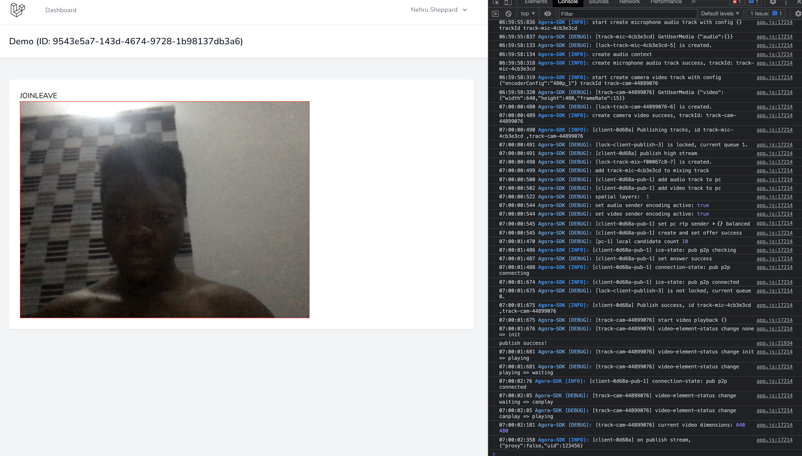
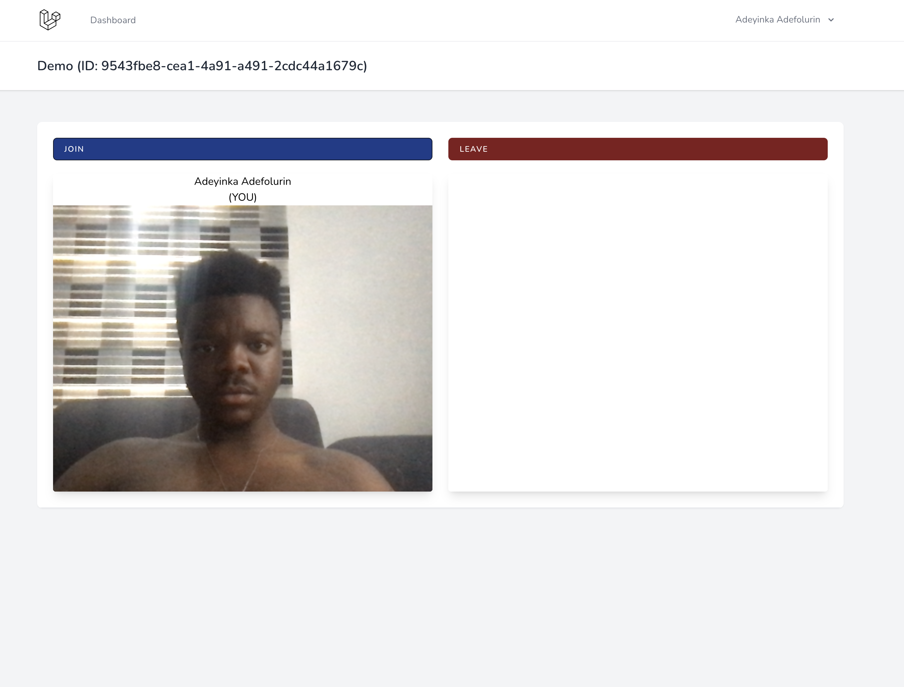
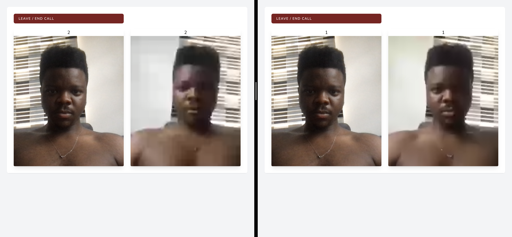

# Video Call Project
This is a simple project for Video Calling via the web. Using Agora.io

## Scope
- User creates a channel.
- Other users may see a list of all channels.
- Each channel lasts only 1 hour.
- The owner of a channel may lock a channel if they do not need others to join.

### Technical Notes
- When a user intends to join a channel, the system;
  - Double-checks to ensure the channel has not ended. If it has ended, the component notifies the user and then refreshes the list.
  - Checks to ensure the channel is not locked.
- Only the owner of a channel can close it.
- A channel is only active for 1 hour, after which it closes automatically.

## References
1. [Database Design](https://dbdiagram.io/d/61ceb4b03205b45b73d2ab20)

## Tests
1. Basic Video Call
   Straight from the docs...
   
2. Small styling
   
3. Improved
   
